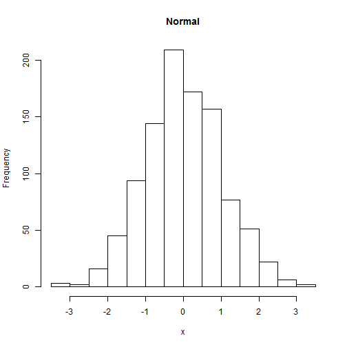

Data Products
Course Project
========================================================
author:BAO 
date: Thu Sep 11 11:03:04 2014

Presentation Outline
========================================================

- Project Description
- Shiny App
- Conclusion

Project Description
========================================================

The Coursera Developing Data Products course includes a project designed
to exercise your understanding of Shiny to create interactive R programs, and
either Slidify or Rstudio Presenter to present your analysis in a slide deck.

The project has two components:

1. Create a Shiny application, publish it to Rstudio's Shiny server and
make the code availabe on github

2. Create a Slidify or Rstudio Presentor presentation to describe your applicaiton, then 
publish the presentation to make it publically available

Shiny App
========================================================

The Shiny app developed for this project displays a histogram of Normally distributed data points.
It gets the distribution mean and standard deviation from the user using slider bars. The display updates when the user hits the Submit button.

An example of the output looks like this:


```r
mu <- 0; sigma <- 1; x <- rnorm(1000, mu, sigma)
hist(x, main='Normal Distribution', xlab='Data Values')
```

 

Conclusion
========================================================

- Shiny is a convenient and powerful, yet simple way to present interactive analysis
- Rstudio's ShinyApp server is an easy way to make your apps available to a wide audience
- Shiny and Rstudio Presenter (used here) combine to provide an excellent way to present your analysis
